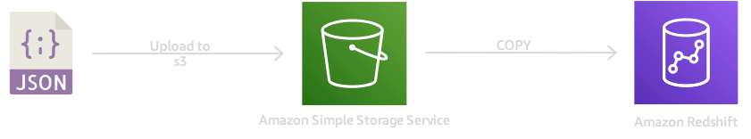
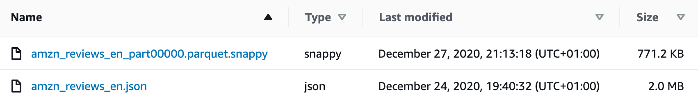
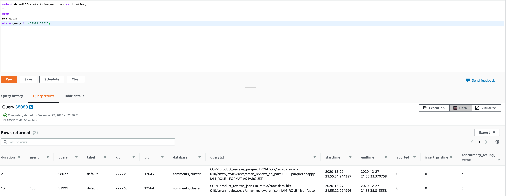
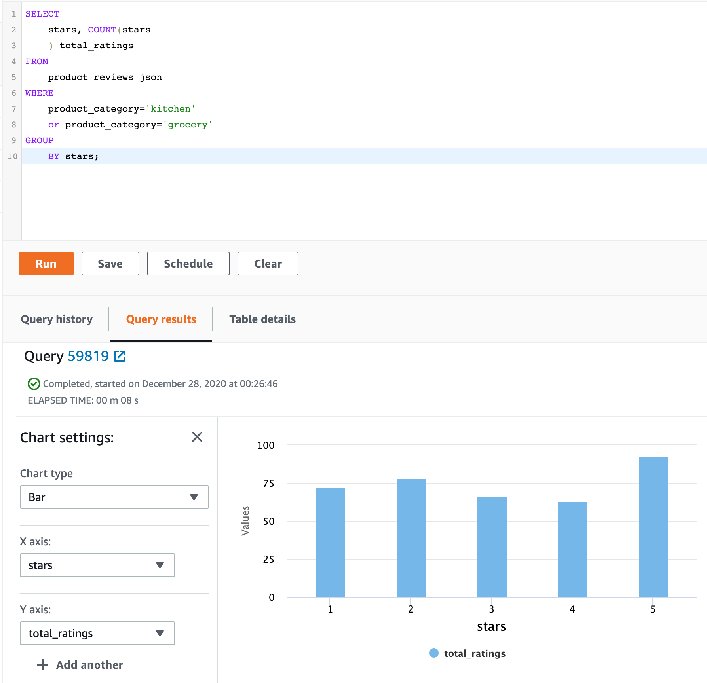
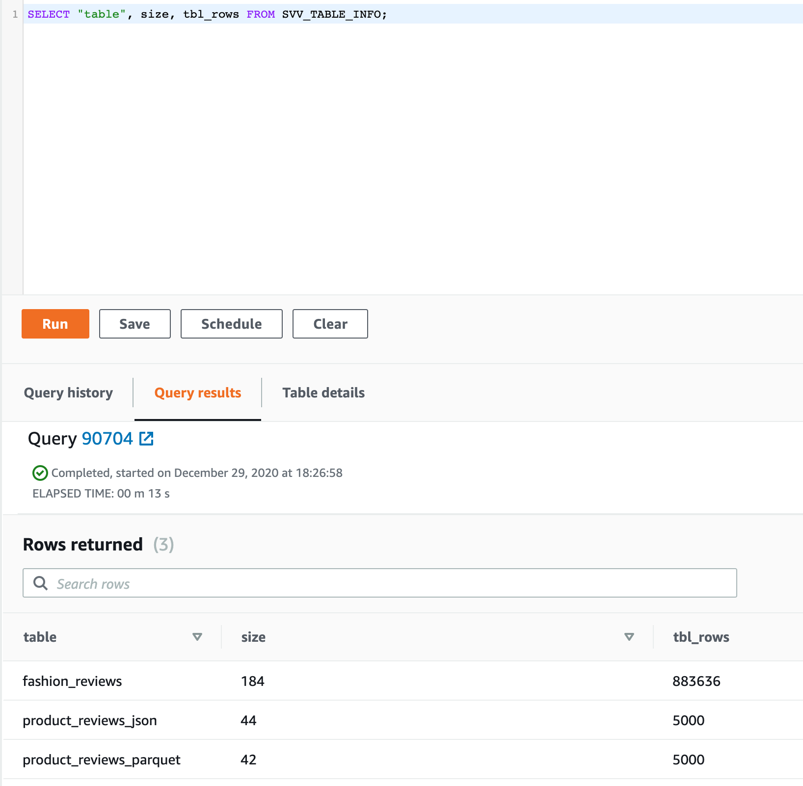

# AWS Redshift - Getting Started

Mystique Unicorn app is generating lot of data. The datascience team is looking to get started with Amazon Redshift as the data warehouse platform of choice.

Can you help them with a proof of concept, to show them how to use Amazon Redshift?

## 🎯 Solutions

We will be build a simple `1-node` redshift cluster, ingest sample data from S3 and run some simple queries.



In this article, we will build an architecture, similar to the one shown above.

1.  ## 🧰 Prerequisites

    This demo, instructions, scripts and cloudformation template is designed to be run in `us-east-1`. With few modifications you can try it out in other regions as well(_Not covered here_).

    - 🛠 AWS CLI Installed & Configured - [Get help here](https://youtu.be/TPyyfmQte0U)
    - 🛠 AWS CDK Installed & Configured - [Get help here](https://www.youtube.com/watch?v=MKwxpszw0Rc)
    - 🛠 Python Packages, _Change the below commands to suit your OS, the following is written for amzn linux 2_
      - Python3 - `yum install -y python3`
      - Python Pip - `yum install -y python-pip`
      - Virtualenv - `pip3 install virtualenv`

1.  ## ⚙️ Setting up the environment

    - Get the application code

      ```bash
      git clone https://github.com/miztiik/redshift-demo
      cd redshift-demo
      ```

1.  ## 🚀 Prepare the dev environment to run AWS CDK

    We will use `cdk` to make our deployments easier. Lets go ahead and install the necessary components.

    ```bash
    # You should have npm pre-installed
    # If you DONT have cdk installed
    npm install -g aws-cdk

    # Make sure you in root directory
    python3 -m venv .venv
    source .venv/bin/activate
    pip3 install -r requirements.txt
    ```

    The very first time you deploy an AWS CDK app into an environment _(account/region)_, you’ll need to install a `bootstrap stack`, Otherwise just go ahead and deploy using `cdk deploy`.

    ```bash
    cdk bootstrap
    cdk ls
    # Follow on screen prompts
    ```

    You should see an output of the available stacks,

    ```bash
    redshift-demo-vpc-stack
    redshift-demo-stack
    ```

1.  ## 🚀 Deploying the application

    Let us walk through each of the stacks,

    - **Stack: redshift-demo-stack**

      To host the redshift cluster, we need a vpc. This will be created as a dependant stack for us. The cluster database is named as `comments_cluster` with superuser as `dwh_user`. The password for the cluster is generated from AWS Secrets Manager. To interact with other AWS Services like S3, we need an IAM Role. This will be created along with the cluster

      Initiate the deployment with the following command,

      ```bash
      cdk deploy redshift-demo-stack
      ```

      Check the `Outputs` section of the stack for the cluster endpoint and password.


1.  ## 🔬 Working with Redshift Cluster

    If you have Postgresql client, you can connect to the cluster using the same. But here we will use the AWS Console Redshift Editor for admin functions. In this repo, you will find `data_samples/src/amzn_reviews_en.json`. Copy them to your S3 bucket. We will ingest these files to our cluster. _You can find more sample data here [2].


    If you have python locally installed, here is a dataframe of the `amzn_reviews_en.json` file. Based on this, we can create a table with the following schema
      ```
      >>> df
         language product_category          product_id  ...                                  review_title          reviewer_id stars
      0          en     baby_product  product_en_0878845  ...   Not worth the price and very bad cap design  reviewer_en_0987470   1.0
      1          en            shoes  product_en_0004522  ...                                      Garbage!  reviewer_en_0731158   1.0
      2          en   office_product  product_en_0060687  ...               I do not recommend this printer  reviewer_en_0793876   1.0
      3          en   office_product  product_en_0311791  ...  Don't purchase these refurbished cartridges!  reviewer_en_0837288   1.0
      4          en     baby_product  product_en_0472877  ...                                     Not worth  reviewer_en_0878169   1.0
      ...       ...              ...                 ...  ...                                           ...                  ...   ...
      4995       en             home  product_en_0068982  ...                                      So Cute!  reviewer_en_0061521   5.0
      4996       en          kitchen  product_en_0563046  ...                                       Perfect  reviewer_en_0871798   5.0
      4997       en     pet_products  product_en_0848682  ...                        My Doberman Loves Them  reviewer_en_0474236   5.0
      4998       en            other  product_en_0536493  ...                                    Five Stars  reviewer_en_0546192   5.0
      4999       en          apparel  product_en_0964853  ...                                   SUPER CUTE!  reviewer_en_0850986   5.0

      [5000 rows x 8 columns]
      ```

      ```py
      >>> print("Schema: {}".format(pfile.schema))
      Schema: language: string
      -- field metadata --
      PARQUET:field_id: '1'
      product_category: string
      -- field metadata --
      PARQUET:field_id: '2'
      product_id: string
      -- field metadata --
      PARQUET:field_id: '3'
      review_body: string
      -- field metadata --
      PARQUET:field_id: '4'
      review_id: string
      -- field metadata --
      PARQUET:field_id: '5'
      review_title: string
      -- field metadata --
      PARQUET:field_id: '6'
      reviewer_id: string
      -- field metadata --
      PARQUET:field_id: '7'
      stars: string
      -- field metadata --
      PARQUET:field_id: '8'
      -- schema metadata --
      org.apache.spark.sql.parquet.row.metadata: '{"type":"struct","fields":[{"' + 545
      >>> 
      ```

      **CREATE TABLE:**

      We will name our table as `product_reviews_json` using the following sql command.

      ```sql
      CREATE TABLE IF NOT EXISTS product_reviews_json(
      review_id           varchar(100)        not null    distkey sortkey,
      product_id          varchar(100)        not null,
      stars               varchar(10)         not null,
      review_body         varchar(10000)      not null,
      review_title        varchar(1000)       not null,
      reviewer_id         varchar(100)        not null,
      language            varchar(2)          not null,
      product_category    varchar(100)        not null,
      primary key(review_id)
      );
      ```

      To make the data ingestion faster, split your files - _Ideally matching your slices_. Here is a list of best practices to improve performance[1]. One of the recommendations is to use a columnar compressed format like _parquet_ compressed using _snazzy_. You can also find the reviews data in parquet format `data_samples/src/amzn_reviews_en_part00000.parquet.snappy`. In S3 you can see the size taken by these two files,

      

      _In case you made any error, you can drop the table using `DROP TABLE public.product_reviews_json;` and try again.

      **INGEST DATA TO Redshift:**

      We will use the `COPY` command<sup>[3]</sup> to ingest our JSON file. 

      ```sql
      COPY product_reviews_json
      FROM 's3://YOUR-BUCKET-NAME/amzn_reviews_en.json' 
      IAM_ROLE 'YOUR-REDSHIFT-IAM-ROLE-ARN'
      json 'auto ignorecase';
      ```

      This file has `5000` records, let us confirm we have ingested all our data.
      ```sql
      /* COUNT FOR ALL RECORDS */
      SELECT COUNT(*) FROM product_reviews_json;
      ```

      **INGEST Performance:**
      If you are using split and compressed files, your ingest performance can improve. Since our file is hardly `2MB`, this query shows a small improvement in performance. But do try with a large file ~ few GBs or TBs

      ```sql
      select datediff(s,starttime,endtime) as duration,
      * 
      from 
      stl_query 
      where query in (
          57991, /*  query id of json copy */
          58689  /*  query id of parquet copy */
      );
      ```
      


      **TROUBLESHOOTING LOAD ERRORS:**
      In case you are getting errors when you are loading data, You can troubleshoot those errors with these queries. The following query joins `STL_LOAD_ERRORS` to `STL_LOADERROR_DETAIL` to view the details errors that occurred during the most recent load.

      ```sql
      select d.query, substring(d.filename,14,20), 
      d.line_number as line, 
      substring(d.value,1,16) as value,
      substring(le.err_reason,1,48) as err_reason
      from stl_loaderror_detail d, stl_load_errors le
      where d.query = le.query
      and d.query = pg_last_copy_id();
      ```

      ```text
      query |    substring      | line |  value   |              err_reason
      -------+-------------------+------+----------+----------------------------
          558| allusers_pipe.txt |  251 | 251      | String contains invalid or unsupported UTF8 code
          558| allusers_pipe.txt |  251 | ZRU29FGR | String contains invalid or unsupported UTF8 code
          558| allusers_pipe.txt |  251 | Kaitlin  | String contains invalid or unsupported UTF8 code
          558| allusers_pipe.txt |  251 | Walter   | String contains invalid or unsupported UTF8 code
      ```

      The following example uses `STL_LOAD_ERRORS` with `STV_TBL_PERM` to create a new view, and then uses that view to determine what errors occurred while loading data into the `EVENT` table: 

      ```sql
      create view loadview as
      (select distinct tbl, trim(name) as table_name, query, starttime,
      trim(filename) as input, line_number, colname, err_code,
      trim(err_reason) as reason
      from stl_load_errors sl, stv_tbl_perm sp
      where sl.tbl = sp.id);
      ```

      Next, the following query actually returns the last error that occurred while loading the `EVENT` table: 

      ```sql
      select table_name, query, line_number, colname, starttime, 
      trim(reason) as error
      from loadview
      where table_name ='event'
      order by line_number limit 1;
      ```

      The query returns the last load error that occurred for the `EVENT` table. If no load errors occurred, the query returns zero rows. In this example, the query returns a single error: 

      ```text
      table_name | query | line_number | colname | error | starttime
      ------+-----+----+----+--------------------------------------------------------+----------------------
      event | 309 |  0 |  5 | Error in Timestamp value or format [%Y-%m-%d %H:%M:%S] | 2014-04-22 15:12:44

      (1 row)
      ```

      **RUN QUERIES:**

      Let us say, We want to answer this question: "Do people who buy kitchen and `grocery` items `leave` higher ratings?"

      ```sql
      SELECT stars, COUNT(stars) total_ratings FROM product_reviews_json WHERE product_category='kitchen' or product_category='grocery'
      GROUP BY stars;
      ```

      

      **VISUALIZING in Amazon Quicksight:**
      To allow visualzing this data in quicksight, The redshift cluster has a security group that allows access from quicksight IP in `us-east-1`.
      


      **Housekeeping Redshift:**
      Over a period of time, tables will get filled up with data and you may have to prune them or remove them. This query will give you the size of your tables,
      

      ```sql
      SELECT "table", size, tbl_rows FROM SVV_TABLE_INFO;
      ```


1.  ## 📒 Conclusion

    Here we have demonstrated how to create a redshift cluster, ingest data, querty and visualize data. You can extend this idea to process the data using AWS Glue and then ingest into the cluster.

1.  ## 🧹 CleanUp

    If you want to destroy all the resources created by the stack, Execute the below command to delete the stack, or _you can delete the stack from console as well_

    - Resources created during [Deploying The Application](#-deploying-the-application)
    - Delete CloudWatch Lambda LogGroups
    - _Any other custom resources, you have created for this demo_

    ```bash
    # Delete from cdk
    cdk destroy

    # Follow any on-screen prompts

    # Delete the CF Stack, If you used cloudformation to deploy the stack.
    aws cloudformation delete-stack \
      --stack-name "MiztiikAutomationStack" \
      --region "${AWS_REGION}"
    ```

    This is not an exhaustive list, please carry out other necessary steps as maybe applicable to your needs.

## 📌 Who is using this

This repository aims to show how to setup a redshift datawarehouse to new developers, Solution Architects & Ops Engineers in AWS. Based on that knowledge these Udemy [course #1][103], [course #2][102] helps you build complete architecture in AWS.

### 💡 Help/Suggestions or 🐛 Bugs

Thank you for your interest in contributing to our project. Whether it is a bug report, new feature, correction, or additional documentation or solutions, we greatly value feedback and contributions from our community. [Start here](/issues)

### 👋 Buy me a coffee

[](https://ko-fi.com/Q5Q41QDGK) Buy me a [coffee ☕][900].

### 📚 References

1. [Amazon Redshift best practices for loading data][1]

1. [Sample Data][2]

1. [Using a COPY command to load data][3]

1. [Registry of Open Data on AWS][4]


### 🏷️ Metadata


**Level**: 300

[1]: https://docs.aws.amazon.com/redshift/latest/dg/c_loading-data-best-practices.html

[2]: http://deepyeti.ucsd.edu/jianmo/amazon/index.html
[3]: https://docs.aws.amazon.com/redshift/latest/dg/t_Loading_tables_with_the_COPY_command.html
[4]: https://registry.opendata.aws/usage-examples/

[100]: https://www.udemy.com/course/aws-cloud-security/?referralCode=B7F1B6C78B45ADAF77A9
[101]: https://www.udemy.com/course/aws-cloud-security-proactive-way/?referralCode=71DC542AD4481309A441
[102]: https://www.udemy.com/course/aws-cloud-development-kit-from-beginner-to-professional/?referralCode=E15D7FB64E417C547579
[103]: https://www.udemy.com/course/aws-cloudformation-basics?referralCode=93AD3B1530BC871093D6
[899]: https://www.udemy.com/user/n-kumar/
[900]: https://ko-fi.com/miztiik
[901]: https://ko-fi.com/Q5Q41QDGK
